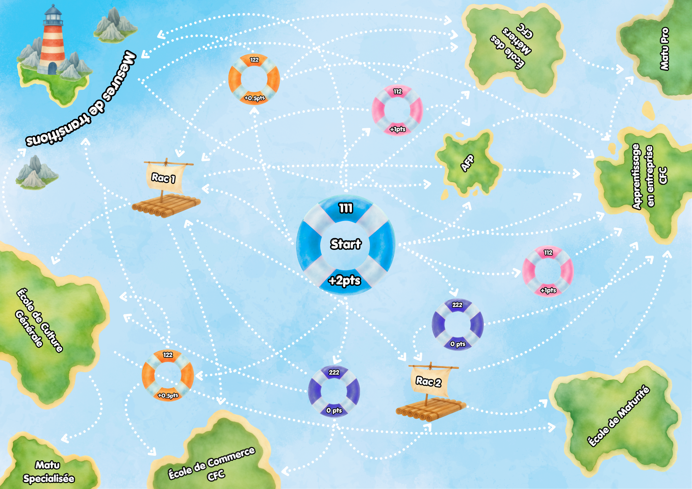

# Cocosp-la-poule-de-l-orientation
Cocosp, La poule de l'Orientation

Ce repo contient les fichiers pour le jeux dévellopé dans le cadre de notre master en Psychologie de l'orientation.
Ce jeu a pour but d'introduire le système de formation obligatoire et post-obligatoire suisse au enfants en fin de scolarité.
Il se présente sous un mélange entre jeu de rôle / dés + plateau à explorer.
Les joueur se vois assigné chacun une carte but (tel que faire un CFC + Matu) et commence tous en VG111 puis tir leurs notes et stages au dés puis prennent la décision des passerelles a suivre pour atteindre leurs but.

# Matériel
- 1X plateau de jeu imprimé A2 (PLATEAU_JEU.png)
- 6X Dés 20
- 36X Dés 6
- 6X Poule COCOSP imprimé en 3D (Variante A ou B)
- Une boite pour ranger le matériel (https://boxes.hackerspace-bamberg.de/)

